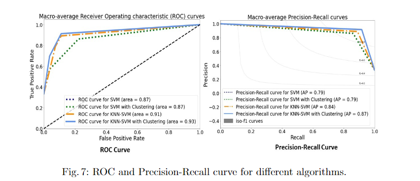
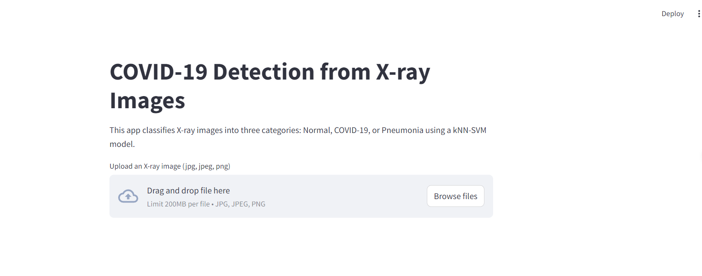

# COVID-19 Pneumonia Detection Using kNN-SVM and VGG16 Features

## Overview
This repository implements a novel COVID-19 Pneumonia detection system using a combination of deep feature extraction from chest X-rays via the VGG16 architecture and a kNN-SVM hybrid model for classification. The project is designed to scale easily for large datasets and features a flexible architecture that allows hyperparameter tuning via command-line arguments.

---

## Model Pipeline

      +------------------------------+
      | 1. Data Preprocessing        |
      |    and Augmentation          |
      |  - Load Images               |
      |  - Normalize                 |
      |  - Data Augmentation         |
      +------------------------------+
                  |
                  v
      +------------------------------+
      | 2. Exploratory Data Analysis |
      |    (EDA)                     |
      |  - Visualize Class Distributions|
      |  - Visualize Sample Images    |
      +------------------------------+
                  |
                  v
      +------------------------------+
      | 3. Feature Extraction        |
      |    (VGG16)                   |
      |  - Extract Features           |
      |  - Transfer Learning          |
      +------------------------------+
                  |
                  v
      +------------------------------+
      | 4. Dimensionality Reduction  |
      |    (Autoencoder)             |
      |  - Compress Features          |
      |  - Preserve Key Patterns      |
      +------------------------------+
                  |
                  v
      +------------------------------+
      | 5. Classification            |
      |    (kNN-SVM)                 |
      |  - Local Sensitivity (kNN)    |
      |  - Global Stability (SVM)    |
      +------------------------------+
                  |
                  v
      +------------------------------+
      | 6. Evaluation                |
      |  - Accuracy                  |
      |  - Precision                 |
      |  - Recall                    |
      |  - F1-Score                  |
      +------------------------------+

---

## Features
- **Transfer Learning**: Utilizes the pre-trained VGG16 model for deep feature extraction.
- **Autoencoder**: Reduces feature dimensionality to optimize classification.
- **kNN-SVM Hybrid Model**: Combines the strengths of k-Nearest Neighbors (kNN) and Support Vector Machines (SVM) for robust classification.
- **Command-line Interface**: Supports command-line arguments for batch size, number of epochs, kNN neighbors, SVM regularization parameter, and more.

---

## Dependencies
To install the necessary dependencies, run the following command:

```bash
pip install -r requirements.txt

```
---

## Usage
To run the pipeline, use the following command:

```bash
python main.py --data_dir <path_to_data> --batch_size 64 --epochs 20 --k_neighbors 7 --svm_c 0.5 --eda
```
---

## Arguments:

    --data_dir: Path to the directory containing the dataset (train/test split).
    --img_size: Image size (default: 224).
    --batch_size: Batch size for feature extraction and training (default: 32).
    --epochs: Number of epochs for autoencoder training (default: 10).
    --k_neighbors: Number of neighbors for kNN (default: 5).
    --svm_c: SVM regularization parameter C (default: 1.0).
    --eda: Flag to perform EDA (visualizations).

---

## Results
Upon training, the model outputs classification metrics such as precision, recall, F1-score, and accuracy.
<p align = 'left'>
  
</p>

---

<p align = 'left'>
  
</p>

---

## Application

  Before running the Streamlit application, ensure that the FastAPI server is running. If it's not running, start it with:

```bash

uvicorn backend.api:app --reload --host 0.0.0.0 --port 8000
```

---

Then, launch the Streamlit app:

```bash
streamlit run app.py

```

<p align = 'left'>
  
</p>

---

## Citation
If you use this code for your research, please cite:

    @article{covid_knn_svm,
      title={COVID-19 Pneumonia Detection Using kNN-SVM and VGG16 Features},
      author={A Bahuguna, D Yadav, A Senapati, BN Saha},
      journal={International Journal of Machine Learning and AI Research},
      year={2024}
    }

    

